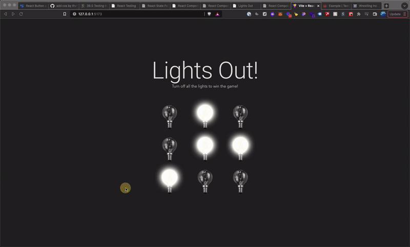

# Lights Out

This is a "Lights Out" game built with React.
The goal of this game is to turn off all the lights.

When you turn off a light, the adjacent light above, below, to the left, and to the right of the target light will also switch.


## Installation and Setup
```shell
npm install
npm run dev
```

## Testing
```shell
npm test
```